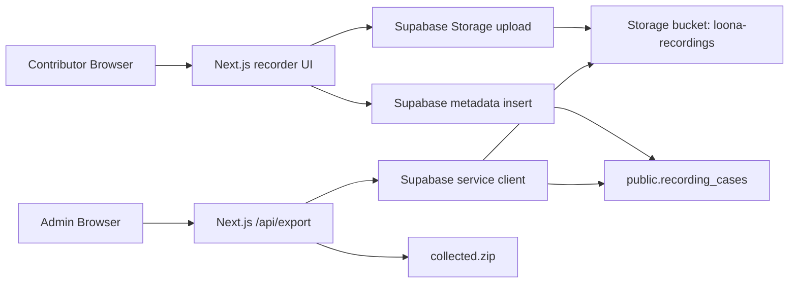

# Loona Record Collaboration Design

## Goal

Build a lightweight web app for collaborative Loona wake-word recording. Contributors can open a Vercel URL, enter a username, record labeled cases, and upload them. The owner can export all recorded cases as a training-compatible `collected.zip`.

## Context

- Repository: `https://github.com/lala1137273514/loona_record.git`
- Current repo state: empty Git repository, no app code yet.
- Source package inspected: `/Users/jason/Downloads/loona_handoff`
- Existing local data format: `16 kHz`, mono, PCM16 WAV.
- Existing export layout:
  - `collected/real_pos/*.wav`
  - `collected/real_neg/*.wav`
- Existing Supabase project to reuse:
  - Project ref: `btjpgadfxrxfytillsod`
  - Region: `us-west-2`
  - Status: active and healthy

## Chosen Approach

Use Next.js on Vercel for the web app and API routes. Use Supabase Storage for WAV files and Supabase Postgres for case metadata. Do not build a full account system. Each contributor gets a browser-local `uid` from `crypto.randomUUID()` and enters a username. The admin export route is protected with a server-only `ADMIN_EXPORT_TOKEN`.

This keeps contributor flow simple while avoiding public read/export access to the dataset.

## User Roles

### Contributor

- Opens the deployed URL.
- Enters a username.
- Gets a stable local `uid` stored in `localStorage`.
- Records prompted or free-form cases.
- Chooses case label:
  - `real_pos`: user said Loona but wake detection missed or positive training sample.
  - `real_neg`: false wake or negative training sample.
- Uploads the WAV and metadata.
- Can see their current session count and latest upload status.

### Owner / Admin

- Opens `/admin`.
- Enters or supplies an admin token.
- Views aggregate counts by label and contributor.
- Exports all cases as `collected.zip`.
- Export includes a `manifest.csv` for traceability.

## Product Scope

### Included

- Mobile and desktop browser recording.
- Username entry.
- Browser-local unique `uid`.
- Prompt list similar to the existing Loona test checklist.
- Positive and negative case recording.
- WAV conversion in browser to `16 kHz`, mono, PCM16.
- Direct upload to Supabase Storage.
- Metadata insert into Supabase Postgres.
- Admin counts.
- Admin export as zip.
- Deploy to Vercel.

### Excluded

- Password login for contributors.
- Team/member management.
- Real-time multi-user presence.
- Wake-word inference in the browser.
- ASR or semantic labeling.
- Editing existing recordings after upload.

## Architecture



## Data Model

### Table: `public.recording_cases`

Columns:

- `id uuid primary key default gen_random_uuid()`
- `uid text not null`
- `username text not null`
- `label text not null check (label in ('real_pos', 'real_neg'))`
- `prompt_key text not null`
- `prompt_text text not null`
- `storage_bucket text not null default 'loona-recordings'`
- `storage_path text not null unique`
- `duration_ms integer not null check (duration_ms > 0)`
- `sample_rate integer not null default 16000`
- `channels integer not null default 1`
- `mime_type text not null default 'audio/wav'`
- `client_created_at timestamptz`
- `created_at timestamptz not null default now()`

Indexes:

- `recording_cases_created_at_idx` on `created_at desc`
- `recording_cases_uid_idx` on `uid`
- `recording_cases_label_idx` on `label`

### Storage Bucket

Bucket name: `loona-recordings`

Path format:

```text
{label}/{uid}/{timestamp}-{caseId}.wav
```

Example:

```text
real_pos/6c7b2a.../20260620T083012Z-6c15e2.wav
```

## Security Model

### Public Client

The browser receives only:

- `NEXT_PUBLIC_SUPABASE_URL`
- `NEXT_PUBLIC_SUPABASE_PUBLISHABLE_KEY`

The browser never receives:

- `SUPABASE_SERVICE_ROLE_KEY`
- `ADMIN_EXPORT_TOKEN`

### Supabase RLS

Enable RLS on `public.recording_cases`.

Policies:

- Allow anonymous insert only.
- Do not allow anonymous select, update, or delete.
- Admin reads use the service role key from Vercel server routes.

Storage policies on `storage.objects`:

- Allow anonymous insert into bucket `loona-recordings`.
- Do not allow anonymous select, update, or delete.
- Avoid upsert; every upload path is unique.

This matches Supabase Storage behavior where uploads require RLS insert policies, and service role keys bypass RLS only from trusted server code.

## API Design

### Browser to Supabase

The recorder uploads directly to Supabase Storage, then inserts metadata.

Direct browser upload avoids routing audio through Vercel function payload limits and reduces server load.

### `GET /api/admin/summary`

Input:

- Header: `x-admin-token: <ADMIN_EXPORT_TOKEN>`

Output:

```json
{
  "total": 10,
  "byLabel": { "real_pos": 9, "real_neg": 1 },
  "byContributor": [
    { "uid": "abc", "username": "jason", "count": 10 }
  ]
}
```

### `GET /api/admin/export`

Input:

- Header: `x-admin-token: <ADMIN_EXPORT_TOKEN>`

Output:

- `Content-Type: application/zip`
- `Content-Disposition: attachment; filename="collected.zip"`

Zip layout:

```text
collected/
  real_pos/
    realpos_{username}_{uid_short}_{created_at}_{id_short}.wav
  real_neg/
    realneg_{username}_{uid_short}_{created_at}_{id_short}.wav
  manifest.csv
```

`manifest.csv` columns:

```text
id,uid,username,label,prompt_key,prompt_text,storage_path,duration_ms,sample_rate,channels,created_at,export_path
```

## Frontend Design

### Main Page

Primary sections:

- Contributor identity panel:
  - username input
  - generated uid display
  - reset uid action
- Recording workflow:
  - prompt checklist
  - label segmented control: `real_pos` / `real_neg`
  - record / stop / playback / upload controls
  - upload status
- Session stats:
  - successful uploads
  - failures
  - last uploaded case

The UI should be dense and task-focused, not a marketing page.

### Admin Page

Primary sections:

- Admin token input.
- Counts by label.
- Counts by contributor.
- Export button.
- Error state for invalid token.

## Audio Requirements

Browser recording uses `navigator.mediaDevices.getUserMedia()` plus Web Audio capture. The app stores float samples while recording, then converts them before upload to:

- WAV container
- PCM16
- mono
- 16000 Hz

If resampling fails, upload is blocked and the UI shows a clear error.

## Environment Variables

### Public

- `NEXT_PUBLIC_SUPABASE_URL`
- `NEXT_PUBLIC_SUPABASE_PUBLISHABLE_KEY`

### Server-only

- `SUPABASE_SERVICE_ROLE_KEY`
- `ADMIN_EXPORT_TOKEN`

`.env.example` will list variable names only. Real values live in `.env.local` and Vercel environment variables.

## Deployment

Target:

- Vercel production deployment.
- Supabase project `btjpgadfxrxfytillsod`.

Implementation will use Vercel CLI after the app builds locally. If the CLI is not installed or not authenticated on this machine, implementation pauses at deployment and asks the owner to complete Vercel login.

Deployment verification:

- Production URL loads main page.
- Browser can create a test case.
- Supabase metadata row appears.
- Supabase Storage object appears.
- Admin summary returns counts with token.
- Admin export downloads a valid zip.

## Testing Plan

Local checks:

- Unit test WAV encoder/resampler metadata.
- Unit test storage path generation.
- Unit test export filename generation.
- Build check with `next build`.

Integration checks:

- Insert a test metadata row through Supabase client.
- Upload a small generated WAV blob to Storage.
- Call admin summary route.
- Call admin export route and verify zip entries.

Manual checks:

- Record in Chrome or Safari.
- Confirm microphone permission failure is shown clearly.
- Confirm uid persists after page reload.
- Confirm username is stored with every case.

## Risks

- Browser audio APIs differ between Safari and Chrome. Mitigation: use Web Audio conversion after capture and verify in both browsers.
- Public anonymous insert can be abused if URL is shared too broadly. Mitigation: no public read/export, unique paths, admin-only export. A lightweight contributor invite token can be added later if abuse appears.
- Vercel CLI may need login on this machine. Mitigation: use the Vercel dashboard or ask for login if CLI deploy is blocked.
- Existing Supabase project has unrelated tables. Mitigation: use dedicated table and bucket names prefixed with `recording_cases` and `loona-recordings`.

## Acceptance Criteria

- A contributor can submit at least one `real_pos` and one `real_neg` case from the deployed site.
- Each case records `uid`, `username`, `label`, prompt metadata, duration, and storage path.
- Uploaded WAV files are mono 16 kHz PCM16.
- Anonymous visitors cannot list or export all cases.
- Admin export produces a valid zip with `collected/real_pos`, `collected/real_neg`, and `manifest.csv`.
- The zip can be unpacked without errors.
